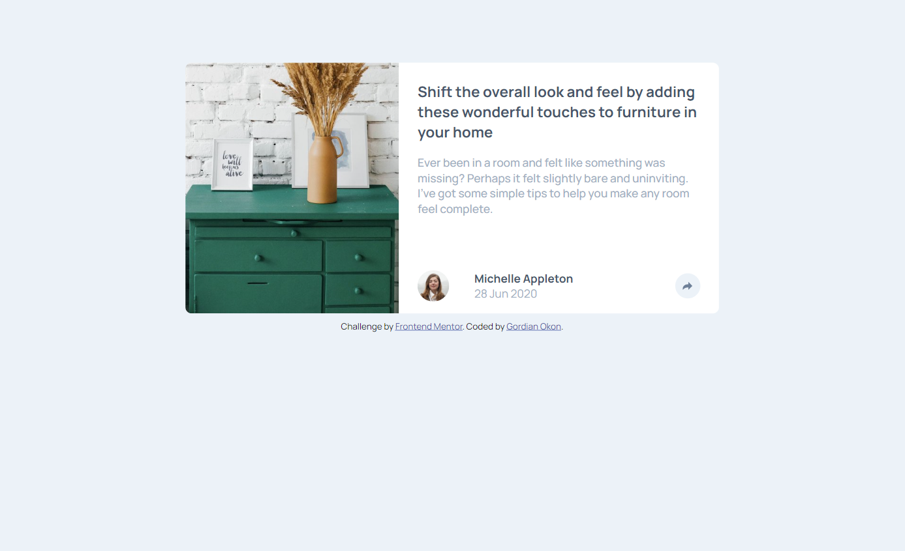

# Frontend Mentor - Article preview component solution

This is a solution to the [Article preview component challenge on Frontend Mentor](https://www.frontendmentor.io/challenges/article-preview-component-dYBN_pYFT). Frontend Mentor challenges help you improve your coding skills by building realistic projects. 

## Table of contents

- [Overview](#overview)
  - [The challenge](#the-challenge)
  - [Screenshot](#screenshot)
  - [Links](#links)
  - [Built with](#built-with)
  - [What I learned](#what-i-learned)
  - [Useful resources](#useful-resources)
- [Author](#author)

## Overview

### The challenge

Users should be able to:

- View the optimal layout for the component depending on their device's screen size
- See the social media share links when they click the share icon

### Screenshot

### Links

- Live Site URL: [article-preview-component](https://article-preview-component-eight-taupe.vercel.app)

### Built with

- Semantic HTML5 markup
- CSS custom properties
- Flexbox
- CSS Grid
- Mobile-first workflow

### Useful resources

- [Example resource 1](https://www.geeksforgeeks.com) - this helped me concerning the clamp in css and also how to check for browser window resize using javascript.

## Author

- Website - [Gordian Okon](https://www.gordian-okon.vercel.app)
- Frontend Mentor - [@guardianprime](https://www.frontendmentor.io/profile/guardianprime)
- Twitter - [@Guardianprime](https://www.twitter.com/GordianOkon)
